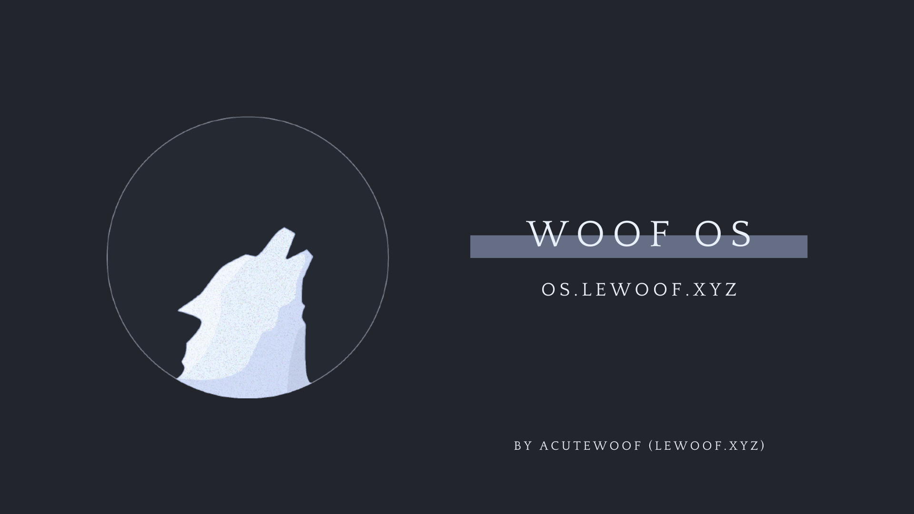

https://os.lewoof.xyz

Woof OS is a simple Arch respin for users who want a quick Arch installation with a comfortable, functional eye candy experience.

---
### Documentation
Qtile: [Common Help (markdown file)](https://os.lewoof.xyz/woofos-help.md) | [Qtile Config](https://github.com/woof-os/qtile/tree/main/doc)

Sway: [Sway and Waybar Config](https://github.com/woof-os/sway-waybar-akirapearl/tree/main/doc)

---

### Donate
**Solana:** 6BecuGmLuD7JJEbQuV7mNqUNZ3i8WPxNC5zL63oAhRJH

**Monero:** 88Ftpu3ncRyLv7Z2c14b9L4MsyWscEqLBJhENxviYtmtRfidDx6G9y3Xyd8aYF8NRV2c2dF5QZiyTfHwuWLH9qmsSpskLhj

**BuyMeACoffee:** [acutewoof](https://buymeacoffee.com/acutewoof)

### Contact
**Discord:** [p6qNduqwWM](https://discord.gg/p6qNduqwWM)

**Email:** sutharshanvithushan@gmail.com
