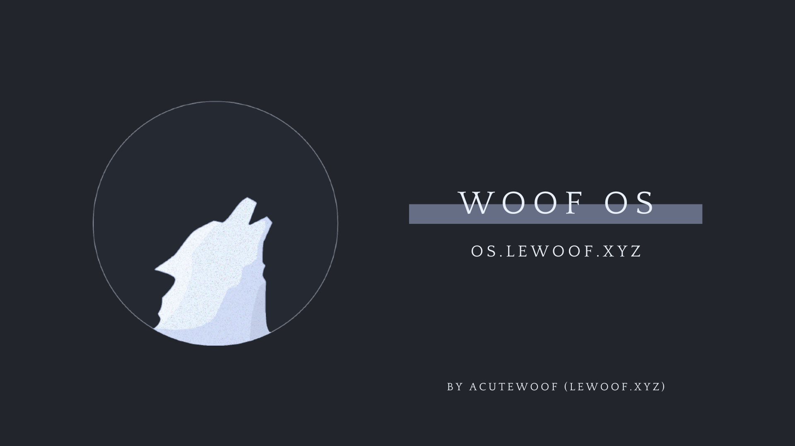

https://os.lewoof.xyz

Woof OS is a simple Arch respin for users who want a quick Arch installation with a comfortable, functional eye candy experience.

---
### Documentation
- Qtile: [Common Help (markdown file)](https://rmd.lewoof.xyz/?url=https://os.lewoof.xyz/woofos-help.md) | [Qtile Config](https://github.com/woof-os/qtile/tree/main/doc)
- Sway: [Sway and Waybar Config](https://github.com/woof-os/sway-waybar-akirapearl/tree/main/doc)

---

### Donate
- **Solana:** JDkK2kpBmPm6YyYnLYNHpw8FhKyZ9AQ2CQTqj6BQxFKY
- **Bitcoin (native segwit):** bc1qh5m8v9xyd8l4yc7d3qfs5a83rqk3eukcjlw6sh
- **BuyMeACoffee:** [acutewoof](https://buymeacoffee.com/acutewoof)

### Contact
- **Discord:** [p6qNduqwWM](https://discord.gg/p6qNduqwWM)
- **Email:** sutharshanvithushan@gmail.com
